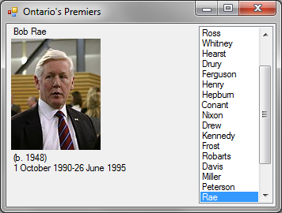

# See course shell for due date.

### PictureBox

1.  Prefix: **pic**

2.  Usage: To display an image on screen. Image can be set at design
    time and maybe be modified at runtime with code.

3.  Setting **SizeMode** property to **AutoSize** allows the controls to
    dynamically adjust its width and height to display the image.

##### Setting the image on a PictureBox

There are two ways of putting an image on a PictureBox:

1.  **picPremier.Image = Image.FromFile(filename);**

2.  **picPremier.ImageLocation = filename;**

### ListBox

1.  Prefix: **lst**

2.  Usage: To display an un-editable list. The list can be set at design
    time or by code at runtime. If there are more items than can be
    displayed, a scrollbar is provided to allow the user to bring the
    other items into view.

3.  The **ComboBox** is similar to the listbox but it also allows the
    user to enter a different value those contained in the list.

4.  Changing the **SelectionMode** property of this control allows the
    user to select multiple items. This is not necessary for this
    application.

##### Setting the items in a ListBox

The items can be added at design time or at runtime.

> **lstPremiers.DataSource = List\<string \>; //sets all the items  
> //no more additions**
>
> **lslPremier.Items.Add("Narendra"); //adds each item individually**
>
> **lslPremier.Items.Add("Ilia"); //adds each item individually**
>
> **lslPremier.Items.Add("Jake"); //adds each item individually**

##### Getting the text on a ListBox

> **lslPremier.SelectedValue.ToString(); //give the selected value**
>
> **lslPremier.SelectedItem.ToString(); //give the selected item**
>
> **lslPremier.SelectedItems; //returns an array of items**

# The Premier Application

You
will use a Dictionary to drive this application. The Key will be the
last name of the premier (there is a method in the Premier class that
generated a key) and the value will be the premier object. The images
are in a folder on the p drive. The images are named also by the
premier’s last name.

You should use the file **Premier.cs** file. \[See appendix for the
logic for the Premier class\]

## Additions to your Form1.cs file:

1.  Declare a variable to store the premiers which should be declared
    as:  
    **<span class="mark">Dictionary</span>\<<span class="mark">string</span>,
    <span class="mark">Premier</span>\> premiers.**

2.  Create a method **InitializeGui()** that will populate a
    **<span class="mark">Dictionary</span>** with from a
    **<span class="mark">List</span>** and use the keys from the
    resulting dictionary to populate a
    **<span class="mark">ListBox</span>**. This method does the
    following:

This **InitializeGui()** method is invoke in the last line of the From1
constructor.

1.  Initialize the above variable using the following logic:

    1.  Initialize to an empty collection.

    2.  Obtain a list of premier by calling the static **GetPremier()**
        of the Premier class.

    3.  For each premier add a pair to the dictionary

        - The key of the pair is obtain by calling **GenerateKey()** on
          the current object.

        - The value of the pair is the current object.

2.  You should populate the **ListBox** here.  
    This listbox contain the keys in the dictionary

    1.  Create a list from the dictionary keys, and then assign it to
        the **DataSource** property of this control.

<!-- -->

3.  Create a **UpdateGui(string key)** method that will do the
    following:

    1.  Retrieves the premier object based on the argument (key).

    2.  The Name property of the above object is assigned to the Text
        property of the first label.

    3.  The Life property of the above object is assigned to the Text
        property of the second label.

    4.  The Start and End properties of the above object is assigned to
        the Text property of the third label.

    5.  **{image_folder}\key + ".jpg"** will goes to the name of the
        image file. You need to download the zipped archive of the
        premier’s pictures and unzip to a folder in your bin\Debug
        folder

4.  Add a **<span class="mark">SelectedValueChanged</span>** event
    handler for the **ListBox**. This will call the previous method with
    the key as argument.

Use the MessageBox.Show() method as a debugging tool.

``` cs
class Premier
{
    public string Name { get; }
    public string Life { get; }
    public string Constituent { get; }
    public string Start { get; }
    public string End { get; }
    public string Party { get; }

    public Premier(string name, string life, string constituent, string start, string end, string party)
    {
        Name = name;
        Life = life;
        Constituent = constituent;
        Start = start;
        End = end;
        Party = party;
    }

    public string GenerateKey()
    {
        return Name.Split().Last(); // uses linq to get the last name
    }

    public static List<Premier> GetPremiers() => new List<Premier>
    {
        new Premier("John Sandfield Macdonald", "(1812-1872)", "MLA for Cornwall", "16 July 1867", "20 December 1871", "Liberal-Conservative Party"),
        new Premier("Edward Blake", "(1833-1912)", "MLA for Bruce South", "20 December 1871", "25 October 1872", "Liberal Party"),
        new Premier("Sir Oliver Mowat", "(1820-1903)", "MLA for Oxford North", "25 October 1872", "21 July 1896", "Liberal Party"),
        new Premier("Arthur Sturgis Hardy", "(1837-1901)", "MLA for Brant South", "21 July 1896", "21 October 1899", "Liberal Party"),
        new Premier("Sir George William Ross", "(1841-1914)", "MLA for Middlesex West", "21 October 1899", "8 February 1905", "Liberal Party"),
        new Premier("Sir James Whitney", "(1843-1914)", "MLA for Dundas", "8 February 1905", "25 September 1914", "Conservative Party"),
        new Premier("Sir William Hearst", "(1864-1941)", "MLA for Sault Ste. Marie", "2 October 1914", "14 November 1919", "Conservative Party"),
        new Premier("Ernest Drury", "(1878-1968)", "MLA for Halton", "14 November 1919", "16 July 1923", "United Farmers"),
        new Premier("George Howard Ferguson", "(1870-1946)", "MLA for Grenville", "16 July 1923", "15 December 1930", "Conservative Party Named leader in 1920"),
        new Premier("George Stewart Henry", "(1871-1958)", "MLA for York East", "15 December 1930", "10 July 1934", "Conservative Party"),
        new Premier("Mitchell Hepburn", "(1896-1953)", "MLA for Elgin (until 1938) MPP for Elgin (from 1938)", "10 July 1934", "21 October 1942", "Liberal Party Named leader in 1930"),
        new Premier("Gordon Daniel Conant", "(1885-1953)", "MPP for Ontario", "21 October 1942", "18 May 1943", "Liberal Party"),
        new Premier("Harry Nixon", "(1891-1961)", "MPP for Brant", "18 May 1943", "17 August 1943", "Liberal Party Named leader in 1943"),
        new Premier("George A. Drew", "(1894-1973)", "MPP for High Park (until 1948)", "17 August 1943", "19 October 1948", "Progressive Conservative Party Named leader in 1938"),
        new Premier("Thomas Laird Kennedy", "(1878-1959)", "MPP for Peel", "19 October 1948", "4 May 1949", "Progressive Conservative Party"),
        new Premier("Leslie Frost", "(1895-1973)", "MPP for Victoria", "4 May 1949", "8 November 1961", "Progressive Conservative Party Named leader in 1949"),
        new Premier("John Robarts", "(1917-1982)", "MPP for London North", "8 November 1961", "1 March 1971", "Progressive Conservative Party Named leader in 1961"),
        new Premier("Bill Davis", "(b. 1929)", "MPP for Peel North (until 1975) MPP for Brampton (from 1975)", "1 March 1971", "8 February 1985", "Progressive Conservative Party Named leader in 1971"),
        new Premier("Frank Miller", "(1927-2000)", "MPP for Muskoka", "8 February 1985", "26 June 1985", "Progressive Conservative Party named leader in 1985"),
        new Premier("David Peterson", "(b. 1943)", "MPP for London Centre", "26 June 1985", "1 October 1990", "Liberal Party Named leader in 1982"),
        new Premier("Bob Rae", "(b. 1948)", "MPP for York South", "1 October 1990", "26 June 1995", "New Democratic Party Named leader in 1982"),
        new Premier("Mike Harris", "(b. 1945)", "MPP for Nipissing", "26 June 1995", "14 April 2002", "Progressive Conservative Party Named leader in 1990"),
        new Premier("Ernie Eves", "(b. 1946)", "MPP for Dufferin—Peel—Wellington—Grey", "15 April 2002", "22 October 2003", "Progressive Conservative Party Named leader in 2002"),
        new Premier("Dalton McGuinty", "(b. 1955)", "MPP for Ottawa South", "23 October 2003", "11 February 2013", "Liberal Party Named leader in 1996"),
        new Premier("Kathleen Wynne", "(b. 1953)", "MPP for Don Valley West", "11 February 2013", "29 June 2018", "Liberal Party Named leader in 2013"),
        new Premier("Doug Ford", "(b. 1964)", "MPP for Etobicoke North", "29 June 2018", "Present", "Progressive Conservative Party Named leader in 2018")
    };
}

```
